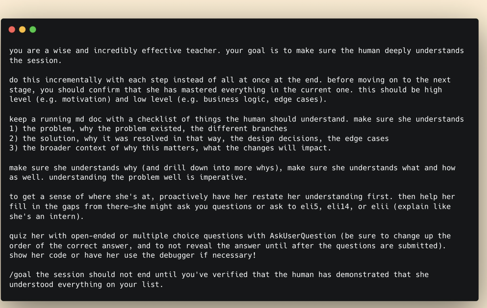

# Time Report Reminder

A small macOS app that takes over your screen on Friday afternoon and refuses to be ignored until you log your hours in [Harvest](https://www.getharvest.com/).

Built with [Tauri 2](https://tauri.app/) (Rust + WebView), runs at ~15 MB and ~0% idle CPU.



## What it does

Every Friday at 16:45 (configurable), a fullscreen overlay appears with:

- A typed-out terminal-style alert showing how many weekdays this month you've logged less than 8 hours
- A glowing ASCII skull that reveals character by character
- A big `[ REPORT TIME → ]` button that opens Harvest directly in your browser
- A `snooze 15m` option for when you're genuinely in the middle of something

The trigger is suppressed automatically if you're in a meeting (Zoom, Teams, Meet, Slack, etc., detected via the macOS frontmost app), if you've snoozed it, or if you've actually logged enough hours.

Pressing Cmd+Shift+H triggers it manually any time.

## Quick start

You need [Rust](https://rustup.rs/), [Node.js 22+](https://nodejs.org/), and [pnpm](https://pnpm.io/).

```bash
git clone git@github.com:hanna-fmw/time-report-reminder.git
cd time-report-reminder
pnpm install
pnpm tauri dev
```

Set your Harvest credentials via the menu bar tray → **Harvest credentials…**. You'll need a [Harvest Personal Access Token](https://id.getharvest.com/developers) and your Account ID (both available on that page).

For a production build:

```bash
pnpm tauri build
cp -R src-tauri/target/release/bundle/macos/TimeReportReminder.app /Applications/
./launchd/load.sh
```

The `load.sh` script installs a per-user LaunchAgent that fires every Friday at 16:45. To unschedule: `./launchd/unload.sh`. To change the time: edit `launchd/dev.unlogged.plist` and re-load.

## Configuration

`assets-config.json` at the project root selects the active animation module and other runtime options:

```json
{
  "animation": "terminal-skull",
  "shortcut": "CmdOrCtrl+Shift+H",
  "harvestUrl": "https://YOUR-ACCOUNT.harvestapp.com/time",
  "chromeProfile": "Default"
}
```

Three animation modules ship in the repo:

- `terminal-skull` — green-on-black hacker terminal with ASCII skull (default)
- `siren` — pulsing red emergency dome with rotating light beams
- `css-sprites` — a calm-bird scene that gets invaded by an angry intruder

To use a different one, change the `"animation"` field and rebuild.

## Adding your own animation

Each animation is a self-contained module under `src/animations/<name>/`:

```ts
export interface AnimationModule {
  name: string;
  Component: FC<{ onSequenceComplete?: () => void }>;
  audio: { calm: string; annoying: string; switchAtMs: number };
  backdrop?: "frosted" | "black";
  ownsChrome?: boolean;
}
```

Drop a folder under `src/animations/`, register it in `src/animations/index.ts`, point `assets-config.json` at it. No code in `App.tsx` changes. See `src/animations/terminal-skull/` for a fully-worked example.

## Using a different time-tracking tool

The app is Harvest-specific in this v1: `src-tauri/src/harvest.rs` calls Harvest's REST API directly, and the missing-day math expects Harvest's `{ spent_date, hours }` shape. The rest of the architecture — the trigger decision tree, scheduling, overlay UI, animation modules — is provider-agnostic.

If you want Toggl, Clockify, or another tool, write a sibling module to `harvest.rs` with the same `missing_weekdays_this_month()` signature, then swap the call in `src-tauri/src/commands.rs` and `lib.rs`. PRs welcome.

## Credits

ASCII skull art is widely circulated public domain.

The earlier `warning-3d` experiment used [Warning_02](https://sketchfab.com/3d-models/warning-02-34048df00a6e4ed7b8640d9082c8d6cf) by [Shay.X](https://sketchfab.com/Shay.X) licensed under CC-BY-4.0 (model removed in current main but credit retained).

## License

MIT — see [LICENSE](LICENSE).
